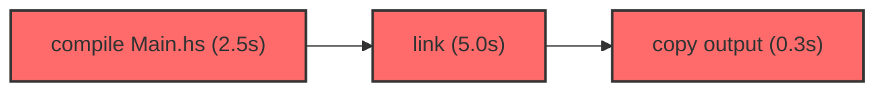

# shake-telemetry

A drop-in replacement for Haskell's [Shake](https://shakebuild.com/) build system that records a dependency graph with timing data, computes the critical path, and outputs JSON and Mermaid visualizations.

## Why

Shake produces profiling reports with rule names and execution times, but doesn't include the dependency edges between rules. Without that information, you can't compute the critical path -- the longest chain of sequential dependencies that determines your minimum build time.

shake-telemetry wraps the Shake API to intercept all dependency-creating calls (`need`, `askOracle`, `doesFileExist`, etc.) and records the full dependency graph as the build executes. After the build, it computes the critical path and writes:

- A **JSON file** with nodes, edges, timing data, and the critical path
- A **Mermaid diagram** of the critical path

## Getting started

### Installation

Add `shake-telemetry` to your `build-depends` in your `.cabal` file:

```cabal
build-depends:
  , shake-telemetry
```

### Usage

Change one import:

```haskell
-- Before
import Development.Shake

-- After
import Development.Shake.Telemetry
```

That's it. Your build code doesn't need any other changes. All Shake functions (`shake`, `shakeArgs`, `%>`, `need`, `phony`, `addOracle`, `parallel`, etc.) work exactly as before, but now produce telemetry output.

### Output

After each build, two files are written to `<shakeFiles>/telemetry/`:

- `build-graph.json` -- the full dependency graph with timing data
- `critical-path.mmd` -- a Mermaid diagram of the critical path

The output directory is derived from the `shakeFiles` option in `ShakeOptions` (defaults to `.shake`).

## How it works

### Wrapping strategy

shake-telemetry wraps three categories of Shake functions:

**Entry points** (`shake`, `shakeArgs`, etc.) -- create a `TelemetryState`, inject it into `shakeExtra`, run the build, then freeze the graph and write outputs.

**Rule definers** (`%>`, `phony`, `addOracle`, etc.) -- wrap the user's action body to register a node and set the thread context before the body runs, and record the end time after.

**Dependency creators** (`need`, `askOracle`, `doesFileExist`, etc.) -- look up the current thread's node and record an edge to each dependency before delegating to Shake.

Everything else (~110 exports) is re-exported unchanged.

### Thread safety

Shake runs rules in parallel. shake-telemetry maintains a `Map ThreadId NodeId` (using strict STM `TVar`s) so that dependency-recording wrappers know which rule is executing on the current thread. The `parallel`, `forP`, and `par` wrappers propagate the parent thread's context to child threads.

### Node deduplication

A target like `src/Main.o` might first appear as a dependency (via `need`) before its own rule executes. `getOrCreateNode` ensures both references map to the same node, with timing data filled in when the rule runs.

### Critical path

The critical path is computed via a topological sort + longest-path DP in O(V+E). Rules on the critical path are bottlenecks -- speeding them up reduces total build time. Rules off the critical path have slack.

## Output format

### JSON

```json
{
  "buildStart": "2024-01-15T10:30:00Z",
  "totalSeconds": 120.5,
  "nodes": [
    {
      "id": 1,
      "label": "src/Main.o",
      "type": "file",
      "startTime": 0.0,
      "endTime": 2.5,
      "duration": 2.5,
      "onCriticalPath": true
    }
  ],
  "edges": [
    { "from": 3, "to": 1 }
  ],
  "criticalPath": [4, 1, 7, 12]
}
```

Node types: `file`, `phony`, `oracle`, `batch`, `directory`, `env`, `action`.

Edges represent dependencies: `from` depends on `to`.

Nodes that were cached (skipped by Shake) have `null` for `startTime`, `endTime`, and `duration`.

### Mermaid



Shows only the critical path subgraph with durations.

## Limitations

- **Cached rules on incremental builds**: When Shake skips a rule (cache hit), the rule body doesn't execute, so its dependencies aren't recorded. Direct dependencies of executing rules appear as placeholder nodes (with `null` timing), but transitive dependencies through cached rules are absent. Fully cached builds produce empty graphs.

- **No Shake internals access**: shake-telemetry wraps the public Shake API. It cannot observe Shake's internal dependency tracking for cached rules.

## Building from source

Requires GHC 9.8.x. Uses Nix + Cabal via [devenv](https://devenv.sh/):

```sh
devenv shell
cabal build
cabal test
```

## License

BSD-3-Clause (same as Shake). See [LICENSE](LICENSE).
